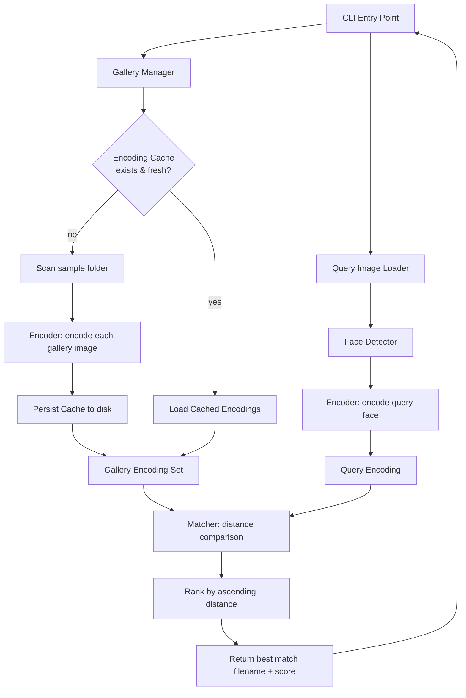
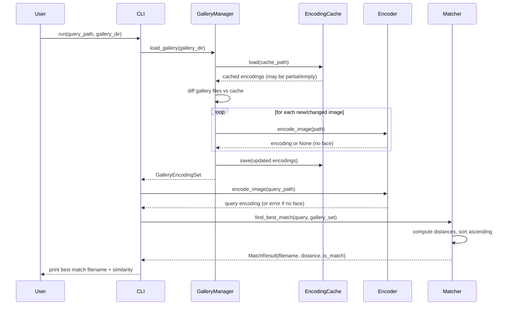
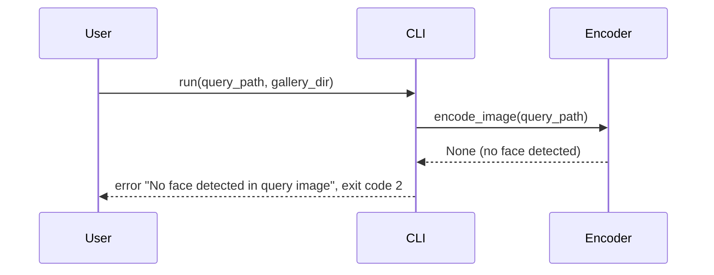

# Design Document: Facial Recognition

## Overview

This feature implements a 1-to-many facial similarity matching program. Given a gallery folder of PNG portrait images (`d:\Mini-Project\FM\sample`), the program accepts a single query image, detects and encodes the face in each image into a numerical feature vector (a face "embedding"), and compares the query encoding against every gallery encoding. It returns the filename of the gallery image whose face is most similar to the query face.

The core technical approach is **face embedding comparison**: a pre-trained deep learning model converts each detected face into a fixed-length vector such that faces of the same person produce vectors that are close together in Euclidean space, while different people produce vectors that are far apart. Similarity is therefore reduced to a distance computation between vectors. To avoid re-encoding the entire gallery on every query, encodings are computed once and persisted to a cache on disk; subsequent queries only encode the single input image and scan the cache.

The implementation uses the Python `face_recognition` library (built on `dlib`'s ResNet-based face encoder) for detection and encoding, with `numpy` for vectorized distance math. The program is delivered as a command-line tool suitable for the Windows environment.

## Architecture



The system is organized into five logical components:

- **Gallery Manager** — discovers image files, orchestrates encoding, and manages the on-disk cache.
- **Face Detector / Encoder** — wraps the underlying model to locate faces and produce embeddings.
- **Matcher** — computes distances between the query encoding and gallery encodings and ranks results.
- **Encoding Cache** — serializes gallery encodings to disk keyed by file path, size, and modification time for fast reuse.
- **CLI** — parses arguments, wires components together, and prints results.

## Sequence Diagrams

### Main flow: matching a query image



### Error flow: query image has no detectable face



## Components and Interfaces

### Component 1: Encoder

**Purpose**: Detect a face in an image and convert it to a fixed-length embedding vector.

**Interface**:
```python
from typing import Optional
import numpy as np

class Encoder:
    def __init__(self, model: str = "hog", num_jitters: int = 1) -> None:
        """model: 'hog' (fast, CPU) or 'cnn' (accurate, slower/GPU)."""

    def encode_image(self, image_path: str) -> Optional[np.ndarray]:
        """Return a 128-d float embedding for the most prominent face,
        or None if no face is detected."""

    def encode_all_faces(self, image_path: str) -> list[np.ndarray]:
        """Return embeddings for every detected face in the image."""
```

**Responsibilities**:
- Load image bytes from disk and normalize to RGB.
- Locate face bounding boxes using the configured detector.
- Produce a 128-dimensional embedding per face.
- Return `None` when no face is present rather than raising.

### Component 2: EncodingCache

**Purpose**: Persist and retrieve gallery encodings to avoid re-encoding on every run.

**Interface**:
```python
from typing import Optional
import numpy as np

class EncodingCache:
    def __init__(self, cache_path: str) -> None: ...

    def load(self) -> dict[str, "CacheEntry"]:
        """Load cache file; return empty dict if missing or corrupt."""

    def save(self, entries: dict[str, "CacheEntry"]) -> None:
        """Atomically write entries to disk."""

    @staticmethod
    def file_signature(image_path: str) -> tuple[int, float]:
        """Return (size_bytes, mtime) used to detect stale entries."""
```

**Responsibilities**:
- Serialize/deserialize encodings (e.g., via `numpy.savez` / pickle).
- Detect stale entries by comparing stored file signature to current.
- Fail safe: a corrupt cache is treated as empty, triggering a rebuild.

### Component 3: GalleryManager

**Purpose**: Build and maintain the set of gallery encodings.

**Interface**:
```python
class GalleryManager:
    def __init__(self, encoder: Encoder, cache: EncodingCache) -> None: ...

    def load_gallery(self, gallery_dir: str) -> "GalleryEncodingSet":
        """Discover images, reuse cache, encode new/changed files,
        persist updates, and return the in-memory encoding set."""
```

**Responsibilities**:
- Enumerate supported image files (`*.png`, case-insensitive) in the gallery directory.
- Reconcile current files against cache (add new, refresh changed, drop deleted).
- Skip and log images with no detectable face.

### Component 4: Matcher

**Purpose**: Compare a query encoding against the gallery and rank by similarity.

**Interface**:
```python
class Matcher:
    def __init__(self, threshold: float = 0.6) -> None:
        """threshold: max distance to be considered the same person."""

    def find_best_match(
        self, query: np.ndarray, gallery: "GalleryEncodingSet"
    ) -> Optional["MatchResult"]:
        """Return the closest gallery entry, or None if gallery is empty."""

    def rank(
        self, query: np.ndarray, gallery: "GalleryEncodingSet", top_k: int = 5
    ) -> list["MatchResult"]:
        """Return the top_k closest entries sorted by ascending distance."""
```

**Responsibilities**:
- Compute Euclidean distance between the query and every gallery encoding.
- Convert distance to a similarity score in `[0, 1]`.
- Flag whether the best match falls within the same-person threshold.

### Component 5: CLI

**Purpose**: Command-line orchestration and output.

**Interface**:
```python
def main(argv: list[str]) -> int:
    """Parse args (query path, --gallery, --threshold, --top-k, --model),
    run the pipeline, print results, and return an exit code."""
```

**Responsibilities**:
- Validate inputs (query file exists, gallery dir exists).
- Wire Encoder, EncodingCache, GalleryManager, Matcher.
- Print the best-match filename and similarity, plus optional top-k.
- Map error conditions to exit codes.

## Data Models

### Model 1: CacheEntry

```python
from dataclasses import dataclass
import numpy as np

@dataclass(frozen=True)
class CacheEntry:
    image_path: str       # absolute path to gallery image
    size_bytes: int       # file size at encode time
    mtime: float          # modification time at encode time
    encoding: np.ndarray  # 128-d float64 embedding
```

**Validation Rules**:
- `encoding` must have shape `(128,)`.
- `size_bytes >= 0` and `mtime > 0`.
- `image_path` must be non-empty.

### Model 2: GalleryEncodingSet

```python
from dataclasses import dataclass, field
import numpy as np

@dataclass
class GalleryEncodingSet:
    filenames: list[str] = field(default_factory=list)   # parallel to matrix rows
    matrix: np.ndarray = field(default_factory=lambda: np.empty((0, 128)))

    def __len__(self) -> int: ...
```

**Validation Rules**:
- `matrix.shape == (len(filenames), 128)`.
- `filenames` contains no duplicates.
- Row `i` of `matrix` is the encoding for `filenames[i]`.

### Model 3: MatchResult

```python
from dataclasses import dataclass

@dataclass(frozen=True)
class MatchResult:
    filename: str       # gallery filename of the match
    distance: float     # Euclidean distance to query (lower = more similar)
    similarity: float   # normalized score in [0, 1] (higher = more similar)
    is_match: bool      # True if distance <= threshold
```

**Validation Rules**:
- `distance >= 0`.
- `0 <= similarity <= 1`.
- `is_match == (distance <= threshold)`.

## Algorithmic Pseudocode

### Main matching algorithm

```python
def run(query_path, gallery_dir, threshold, top_k, model):
    # Precondition: query_path is an existing readable image file
    # Precondition: gallery_dir is an existing directory
    # Postcondition: returns MatchResult of the closest gallery face,
    #                or signals an error if no usable face/gallery exists

    encoder = Encoder(model=model)
    cache = EncodingCache(cache_path_for(gallery_dir))
    gallery = GalleryManager(encoder, cache).load_gallery(gallery_dir)

    if len(gallery) == 0:
        return Error("No encodable faces found in gallery")

    query_encoding = encoder.encode_image(query_path)
    if query_encoding is None:
        return Error("No face detected in query image")

    matcher = Matcher(threshold=threshold)
    results = matcher.rank(query_encoding, gallery, top_k=top_k)
    return Success(results[0], results)  # results[0] is the best match
```

**Preconditions:**
- `query_path` points to an existing, readable image.
- `gallery_dir` exists and is readable.

**Postconditions:**
- Returns the gallery entry with minimum distance to the query, or a descriptive error.
- The returned best match is `results[0]` from a list sorted by ascending distance.

### Gallery loading with cache reconciliation

```python
def load_gallery(gallery_dir):
    # Postcondition: every returned encoding corresponds to a current
    #                gallery file with a detectable face
    cached = cache.load()                # dict: path -> CacheEntry
    current_paths = list_png_files(gallery_dir)
    entries = {}

    for path in current_paths:
        sig = file_signature(path)       # (size, mtime)
        # Loop invariant: entries contains valid, fresh encodings
        #                 for all paths processed so far
        if path in cached and cached[path].signature == sig:
            entries[path] = cached[path]               # reuse
        else:
            encoding = encoder.encode_image(path)
            if encoding is not None:
                entries[path] = CacheEntry(path, sig.size, sig.mtime, encoding)
            # else: no face -> skip this image, log a warning

    cache.save(entries)                  # drops deleted files implicitly
    return build_encoding_set(entries)
```

**Preconditions:**
- `gallery_dir` exists; `cache` is initialized.

**Postconditions:**
- Returned `GalleryEncodingSet` contains exactly the current gallery files that have a detectable face.
- The on-disk cache equals `entries` (stale/deleted files removed).

**Loop Invariants:**
- After processing each path, `entries` holds only fresh, valid `(path -> encoding)` pairs for already-seen paths.
- No path appears more than once in `entries`.

### Best-match ranking

```python
def rank(query, gallery, top_k):
    # Precondition: query.shape == (128,); gallery is non-empty
    # Postcondition: returns up to top_k MatchResults sorted by
    #                ascending distance (most similar first)

    distances = euclidean_distances(gallery.matrix, query)  # vectorized, shape (N,)
    order = argsort_ascending(distances)                    # indices, closest first

    results = []
    for i in order[:top_k]:
        d = distances[i]
        results.append(MatchResult(
            filename=gallery.filenames[i],
            distance=d,
            similarity=distance_to_similarity(d),
            is_match=(d <= threshold),
        ))
    return results
```

**Preconditions:**
- `query` is a 128-d vector; `gallery.matrix` has shape `(N, 128)` with `N >= 1`.

**Postconditions:**
- `results` is sorted by ascending `distance`.
- `len(results) == min(top_k, N)`.
- `results[0]` has the minimum distance over the gallery.

**Loop Invariants:**
- Items appended so far are exactly the `k` smallest distances seen, in ascending order (guaranteed by iterating over the sorted `order`).

## Key Functions with Formal Specifications

### Function: euclidean_distances

```python
def euclidean_distances(matrix: np.ndarray, query: np.ndarray) -> np.ndarray:
    """Row-wise L2 distance between each row of matrix and query."""
```

**Preconditions:**
- `matrix.shape == (N, 128)`, `query.shape == (128,)`, both finite floats.

**Postconditions:**
- Returns array of shape `(N,)` where `out[i] == ||matrix[i] - query||_2`.
- All values `>= 0`; no mutation of inputs.

### Function: distance_to_similarity

```python
def distance_to_similarity(distance: float) -> float:
    """Map face distance to a bounded similarity score."""
    return 1.0 / (1.0 + distance)
```

**Preconditions:**
- `distance >= 0`.

**Postconditions:**
- Returns value in `(0, 1]`; monotonically decreasing in `distance`.
- `distance == 0` yields `1.0`.

### Function: file_signature

```python
def file_signature(image_path: str) -> tuple[int, float]:
    """Return (size_bytes, mtime) of the file."""
```

**Preconditions:**
- `image_path` exists and is readable.

**Postconditions:**
- Returns the file's current size and modification time; no side effects.

## Example Usage

```python
# Example 1: Command line — find the most similar face
# > python -m facial_recognition query.png --gallery d:\Mini-Project\FM\sample
# Output:
#   Best match: 100013.png  (similarity 0.82, distance 0.219, same-person: yes)

# Example 2: Programmatic usage
from facial_recognition import Encoder, EncodingCache, GalleryManager, Matcher

encoder = Encoder(model="hog")
cache = EncodingCache(r"d:\Mini-Project\FM\sample\.encodings.npz")
gallery = GalleryManager(encoder, cache).load_gallery(r"d:\Mini-Project\FM\sample")

query = encoder.encode_image(r"d:\path\to\query.png")
if query is None:
    raise SystemExit("No face detected in query image")

matcher = Matcher(threshold=0.6)
best = matcher.find_best_match(query, gallery)
print(best.filename, best.similarity)

# Example 3: Top-K results
for r in matcher.rank(query, gallery, top_k=5):
    print(f"{r.filename}: distance={r.distance:.3f} similarity={r.similarity:.3f}")
```

## Correctness Properties

*A property is a characteristic or behavior that should hold true across all valid executions of a system-essentially, a formal statement about what the system should do. Properties serve as the bridge between human-readable specifications and machine-verifiable correctness guarantees.*

### Property 1: Minimality of best match
For all non-empty galleries `G` and query `q`, `find_best_match(q, G).distance == min(distance(q, g) for g in G)`.

**Validates: Requirements 4.1**

### Property 2: Ranking order
For all `q` and galleries `G`, the list returned by `rank(q, G, k)` is sorted by non-decreasing `distance`.

**Validates: Requirements 4.2**

### Property 3: Self-match identity
For any gallery image `g`, encoding `g` and matching it against a gallery that contains `g` yields `g` as the best match with `distance ≈ 0` and `similarity ≈ 1`.

**Validates: Requirements 4.1, 4.6**

### Property 4: Similarity monotonicity
For all distances `d1 <= d2` with `d1, d2 >= 0`, `distance_to_similarity(d1) >= distance_to_similarity(d2)`, the result lies in `(0, 1]`, and `distance_to_similarity(0) == 1.0`.

**Validates: Requirements 4.6**

### Property 5: Cache equivalence
For an unchanged gallery, matching with a freshly built cache and matching with a reused cache produce identical `MatchResult`s.

**Validates: Requirements 6.1**

### Property 6: Distance symmetry and non-negativity
For all encodings `a, b`, `distance(a, b) == distance(b, a) >= 0`.

**Validates: Requirements 4.5**

### Property 7: No-face handling
For any image where face detection runs successfully but finds no faces, `encode_image` returns `None` and never raises; for any gallery containing such images, those filenames are excluded from the resulting encoding set.

**Validates: Requirements 1.2, 3.4**

### Property 8: Cache round-trip
For any set of valid cache entries, saving them to disk and then loading them produces an equivalent set of entries.

**Validates: Requirements 2.1, 2.2**

### Property 9: Gallery reconciliation freshness
For any gallery directory and prior cache, the reconciled encoding set reuses a cached encoding exactly when the current file signature matches the cached signature, re-encodes when the signature differs, and the persisted cache contains exactly the files currently present in the gallery.

**Validates: Requirements 2.4, 3.2, 3.3, 3.5**

### Property 10: PNG enumeration is case-insensitive
For any set of files in a directory, the GalleryManager selects exactly those whose extension is `.png` matched case-insensitively.

**Validates: Requirements 3.1**

### Property 11: top_k truncation
For any gallery of size `N` and any non-negative `top_k`, `rank(q, G, top_k)` returns exactly `min(top_k, N)` results.

**Validates: Requirements 4.3**

### Property 12: Encoding-set structural invariant
For any reconciled gallery encoding set, the embedding matrix has shape `(len(filenames), 128)` and `filenames` contains no duplicates.

**Validates: Requirements 3.6**

### Property 13: Match flag correctness
For any distance `d` and threshold `t`, the resulting `MatchResult.is_match` is true exactly when `d <= t`.

**Validates: Requirements 4.7**

## Error Handling

### Scenario 1: No face in query image
**Condition**: Detector finds zero faces in the query.
**Response**: Print `"No face detected in query image"`; exit code `2`.
**Recovery**: User supplies a clearer portrait; no state is persisted.

### Scenario 2: No encodable faces in gallery
**Condition**: Every gallery image fails detection, or the folder is empty.
**Response**: Print `"No encodable faces found in gallery"`; exit code `3`.
**Recovery**: User checks the gallery path and image quality.

### Scenario 3: Unreadable / corrupt image file
**Condition**: Image bytes cannot be decoded.
**Response**: For gallery files, log a warning and skip; for the query, exit code `2`.
**Recovery**: Skip-and-continue keeps the gallery usable despite a few bad files.

### Scenario 4: Corrupt encoding cache
**Condition**: Cache file is unreadable or schema mismatch.
**Response**: Treat cache as empty and rebuild; log a warning.
**Recovery**: Automatic — a fresh cache is written after rebuild.

### Scenario 5: Invalid CLI arguments / missing paths
**Condition**: Query file or gallery directory does not exist.
**Response**: Print usage and a specific error; exit code `1`.
**Recovery**: User corrects the path.

## Testing Strategy

### Unit Testing Approach
- `distance_to_similarity`: boundary (`d=0`), monotonicity, range bounds.
- `euclidean_distances`: known vectors with hand-computed distances; shape checks.
- `EncodingCache`: round-trip save/load; stale detection via signature change; corrupt-file fallback to empty.
- `Matcher.rank`: ordering, `top_k` truncation, empty-gallery behavior.
- `Encoder.encode_image`: returns `None` for a face-free image (mock detector); returns 128-d vector for a face.

### Property-Based Testing Approach
- **P2 (ordering)**: generate random gallery matrices and queries; assert `rank` output is sorted ascending by distance.
- **P4 (similarity monotonicity)**: generate ordered distance pairs; assert similarity is non-increasing and within `(0, 1]`.
- **P1 (minimality)**: cross-check `find_best_match.distance` against a brute-force `min` over generated encodings.
- **P5 (cache equivalence)**: build results with and without cache over a fixed synthetic set; assert equality.

**Property Test Library**: `hypothesis`

### Integration Testing Approach
- End-to-end run against a small fixture gallery: query equals a known gallery image (self-match identity, P3) returns that file.
- Run twice to exercise cold-cache then warm-cache paths; assert identical results and faster second run.
- CLI smoke test: valid args produce a best-match line; invalid args produce the correct exit codes.

## Performance Considerations

- **Cache-first design**: encoding the full gallery is the dominant cost; persisting embeddings makes repeat queries O(N) vector math instead of O(N) model inferences.
- **Vectorized distance**: compute all distances with a single `numpy` operation over the `(N, 128)` matrix rather than a Python loop.
- **Detector model trade-off**: `hog` is CPU-friendly and fast; `cnn` is more accurate but needs GPU for reasonable speed. Default to `hog`.
- **Incremental updates**: only new or changed gallery files are re-encoded, keyed by `(size, mtime)`.
- **Memory**: `N` embeddings × 128 float64 ≈ 1 KB per image; even tens of thousands of images fit comfortably in memory.

## Security Considerations

- **Local-only processing**: all images and encodings stay on the local machine; no network calls.
- **Path validation**: confirm query and gallery paths resolve within expected locations; avoid following unexpected symlinks when enumerating the gallery.
- **Cache integrity**: validate cache schema on load; never `pickle`-load untrusted cache files from outside the workspace (prefer `numpy.savez` for encodings + a plain index).
- **Privacy note**: facial embeddings are biometric data; store the cache alongside the gallery and document that it contains derived biometric features.

## Dependencies

- **Python** 3.9+
- **face_recognition** — high-level detection + 128-d encoding API.
- **dlib** — underlying models (installed as a `face_recognition` dependency; may require build tools on Windows, or use a prebuilt wheel).
- **numpy** — vectorized distance math and array storage.
- **Pillow** — image loading/decoding for PNG inputs.
- **hypothesis** (dev) — property-based testing.
- **pytest** (dev) — test runner.
