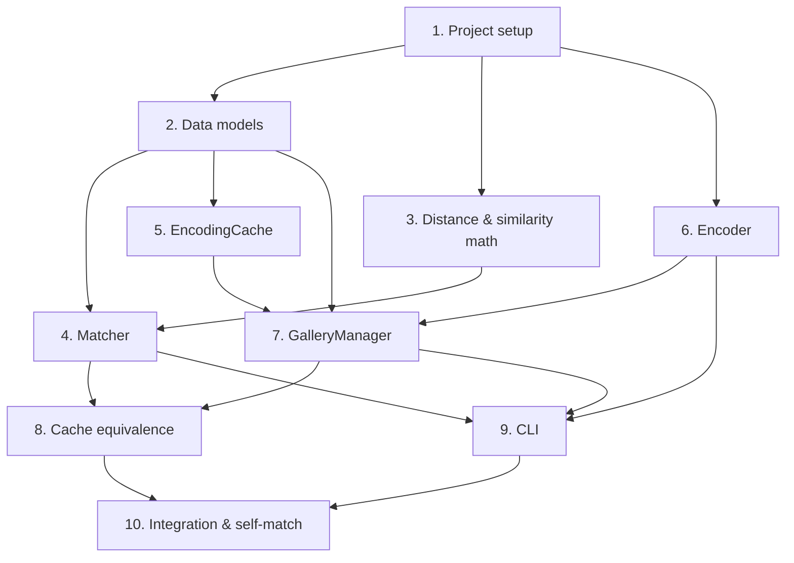

# Implementation Plan

## Overview

This plan builds the facial recognition CLI tool in Python using a test-driven, bottom-up approach. It starts with project setup and pure data models, then layers in the distance/similarity math, the Matcher, the EncodingCache, the Encoder, and the GalleryManager, before wiring the CLI and finishing with integration and self-match tests. Pure-logic components (math, matcher, cache, reconciliation) are validated with `hypothesis` property-based tests at >=100 iterations each; model-dependent and orchestration behavior is covered with example and integration tests, with the `face_recognition`/`dlib` dependency isolated behind a mockable seam so logic tests run without it.

## Tasks

- [x] 1. Set up project structure and dependencies
  - Create the `facial_recognition` package directory with `__init__.py` exposing the public API (Encoder, EncodingCache, GalleryManager, Matcher).
  - Create `requirements.txt` (or `pyproject.toml`) pinning `face_recognition`, `numpy`, `Pillow`, and dev deps `pytest`, `hypothesis`.
  - Create a `tests/` directory with an empty `conftest.py` and a `tests/fixtures/` folder for sample images.
  - Verify the environment imports `numpy`, `PIL`, and `hypothesis` (defer `face_recognition`/`dlib` import to runtime so logic tests run without it).
  - _Requirements: 5.3_

- [x] 2. Implement data models
  - [x] 2.1 Define CacheEntry, GalleryEncodingSet, and MatchResult dataclasses
    - Implement `CacheEntry` (frozen) with `image_path`, `size_bytes`, `mtime`, `encoding`, and a `signature` property returning `(size_bytes, mtime)`.
    - Implement `GalleryEncodingSet` with `filenames` and `matrix`, plus `__len__`.
    - Implement `MatchResult` (frozen) with `filename`, `distance`, `similarity`, `is_match`.
    - Add validation helpers (encoding shape `(128,)`, matrix shape `(N, 128)`, no duplicate filenames).
    - _Requirements: 1.1, 3.6, 4.7_

  - [x] 2.2 Write unit tests for model validation
    - Test encoding shape validation, matrix/filenames length agreement, and duplicate-filename rejection.
    - _Requirements: 3.6_

- [x] 3. Implement distance and similarity math
  - [x] 3.1 Implement euclidean_distances and distance_to_similarity
    - Implement row-wise L2 distance over an `(N, 128)` matrix vs a `(128,)` query using vectorized numpy; do not mutate inputs.
    - Implement `distance_to_similarity(d) = 1.0 / (1.0 + d)`.
    - _Requirements: 4.5, 4.6_

  - [x] 3.2 [PBT] Write property test for distance symmetry and non-negativity
    - **Feature: facial-recognition, Property 6: For all encodings a, b, distance(a, b) == distance(b, a) >= 0**
    - Use hypothesis to generate random finite 128-d float vector pairs (min 100 iterations); assert symmetry, non-negativity, and agreement with a brute-force numpy L2.
    - _Requirements: 4.5_

  - [x] 3.3 [PBT] Write property test for similarity monotonicity
    - **Feature: facial-recognition, Property 4: For all distances d1 <= d2 (both >= 0), similarity(d1) >= similarity(d2), result in (0, 1], and similarity(0) == 1.0**
    - Generate ordered non-negative distance pairs (min 100 iterations); assert non-increasing, bounds `(0, 1]`, and `similarity(0) == 1.0`.
    - _Requirements: 4.6_

- [x] 4. Implement Matcher
  - [x] 4.1 Implement Matcher.find_best_match and Matcher.rank
    - Compute all distances via `euclidean_distances`, argsort ascending, build `MatchResult`s with similarity and `is_match = distance <= threshold`.
    - `rank` returns `min(top_k, N)` results; `find_best_match` returns `results[0]` or `None` for an empty gallery.
    - _Requirements: 4.1, 4.2, 4.3, 4.4, 4.7_

  - [x] 4.2 [PBT] Write property test for ranking order
    - **Feature: facial-recognition, Property 2: For all q and galleries G, rank(q, G, k) is sorted by non-decreasing distance**
    - Generate random gallery matrices and queries (min 100 iterations); assert output distances are non-decreasing.
    - _Requirements: 4.2_

  - [x] 4.3 [PBT] Write property test for minimality of best match
    - **Feature: facial-recognition, Property 1: For all non-empty galleries G and query q, find_best_match(q, G).distance == min over G**
    - Generate random galleries+queries (min 100 iterations); cross-check against brute-force min.
    - _Requirements: 4.1_

  - [x] 4.4 [PBT] Write property test for top_k truncation
    - **Feature: facial-recognition, Property 11: For any gallery size N and non-negative top_k, rank returns exactly min(top_k, N) results**
    - Generate random N and top_k including 0 (min 100 iterations); assert result length.
    - _Requirements: 4.3_

  - [x] 4.5 [PBT] Write property test for match flag correctness
    - **Feature: facial-recognition, Property 13: For any distance d and threshold t, is_match is true exactly when d <= t**
    - Generate random distances and thresholds (min 100 iterations); assert flag equals `d <= t`.
    - _Requirements: 4.7_

  - [x] 4.6 Write unit test for empty-gallery behavior
    - Assert `find_best_match` returns `None` and `rank` returns `[]` for an empty `GalleryEncodingSet`.
    - _Requirements: 4.4_

- [x] 5. Implement EncodingCache
  - [x] 5.1 Implement file_signature, save, and load
    - `file_signature` returns `(size_bytes, mtime)` from `os.stat`.
    - `save` writes atomically (write temp file, then `os.replace`) using `numpy.savez` for encodings plus a plain index of paths/signatures.
    - `load` returns `dict[str, CacheEntry]`, returning `{}` on missing or corrupt files (catch decode/schema errors).
    - _Requirements: 2.1, 2.2, 2.3, 2.5, 2.6_

  - [x] 5.2 [PBT] Write property test for cache round-trip
    - **Feature: facial-recognition, Property 8: For any set of valid cache entries, save then load produces an equivalent set**
    - Generate random dicts of `CacheEntry` (random paths, signatures, 128-d vectors) (min 100 iterations); save to a temp path, load, assert equality (paths, signatures, encodings allclose).
    - _Requirements: 2.1, 2.2_

  - [x] 5.3 Write unit tests for missing/corrupt cache and signature staleness
    - Assert `load` returns `{}` for a nonexistent path and for a garbage/corrupt file (covers both-missing-and-corrupt by treating as empty).
    - Assert a `CacheEntry` is detected stale when current signature differs from stored.
    - _Requirements: 2.3, 2.4_

- [x] 6. Implement Encoder
  - [x] 6.1 Implement Encoder with detector abstraction
    - Load and normalize image to RGB via Pillow; call `face_recognition` for locations and encodings behind a small seam that can be mocked.
    - `encode_image` returns the most prominent face's 128-d embedding, `None` when detection succeeds with zero faces, and signals a decoding failure for undecodable bytes without crashing.
    - `encode_all_faces` returns one embedding per detected face; honor the `model` ("hog"/"cnn") option.
    - _Requirements: 1.1, 1.2, 1.3, 1.4, 1.5_

  - [x] 6.2 Write unit tests for Encoder using a mocked detector
    - Mock zero faces -> `None`, no raise; mock one face -> `(128,)`; mock multiple faces -> list of embeddings; undecodable bytes -> handled failure.
    - Assert the configured model is passed to the detector for both "hog" and "cnn".
    - _Requirements: 1.2, 1.3, 1.4, 1.5_

- [ ] 7. Implement GalleryManager
  - [x] 7.1 Implement load_gallery with cache reconciliation
    - Enumerate `*.png` case-insensitively; reuse cached entry when signature matches, re-encode when it differs, skip-and-log images with no detectable face, persist a cache that drops deleted files, and build the `GalleryEncodingSet`.
    - _Requirements: 3.1, 3.2, 3.3, 3.4, 3.5, 3.6_

  - [x] 7.2 [PBT] Write property test for PNG enumeration case-insensitivity
    - **Feature: facial-recognition, Property 10: GalleryManager selects exactly files whose extension is .png matched case-insensitively**
    - Generate random filename sets with varied extensions/cases in a temp dir (min 100 iterations); assert selected set equals the case-insensitive `.png` subset.
    - _Requirements: 3.1_

  - [ ] 7.3 [PBT] Write property test for gallery reconciliation freshness
    - **Feature: facial-recognition, Property 9: Reconciliation reuses cached encodings iff signature matches, re-encodes otherwise, and persisted cache contains exactly current files**
    - Use a mock encoder counting calls; generate cache+current file sets with matching/differing/deleted/new signatures (min 100 iterations); assert reuse vs re-encode decisions and that saved cache excludes deleted files.
    - _Requirements: 2.4, 3.2, 3.3, 3.5_

  - [ ] 7.4 [PBT] Write property test for no-face exclusion and structural invariant
    - **Feature: facial-recognition, Property 7: Gallery images with no detectable face are excluded from the encoding set**
    - **Feature: facial-recognition, Property 12: The embedding matrix has shape (len(filenames), 128) with no duplicate filenames**
    - Mock encoder returning `None` for a random subset (min 100 iterations); assert excluded filenames are absent, included present, matrix shape matches, and no duplicates.
    - _Requirements: 1.2, 3.4, 3.6_

- [x] 8. Implement cache-equivalence behavior and test
  - [x] 8.1 [PBT] Write property test for cache equivalence (cold vs warm)
    - **Feature: facial-recognition, Property 5: For an unchanged gallery, fresh-cache and reused-cache matching produce identical MatchResults**
    - Over a fixed synthetic encoding set with a mock encoder, build results with an empty cache (cold) and then a reused cache (warm) (min 100 iterations on the synthetic data/query); assert `MatchResult`s are equal.
    - _Requirements: 6.1_

- [x] 9. Implement CLI
  - [x] 9.1 Implement argument parsing and pipeline wiring
    - Parse `query` path, `--gallery`, `--threshold`, `--top-k`, `--model`; validate paths; wire Encoder, EncodingCache, GalleryManager, Matcher; print best-match filename with similarity and distance, plus top_k lines (none when `top_k == 0`).
    - Map errors to exit codes: invalid/missing paths -> 1, no query face -> 2, no gallery faces -> 3.
    - _Requirements: 5.1, 5.2, 5.3, 5.4, 5.5, 5.6_

  - [x] 9.2 Write unit tests for CLI exit codes and output
    - Missing query/gallery -> exit 1 with specific message; mocked no-query-face -> "No face detected in query image" exit 2; empty/face-free gallery -> "No encodable faces found in gallery" exit 3.
    - Valid run on a mocked pipeline prints filename, similarity, distance; `--top-k 0` prints no match lines.
    - _Requirements: 5.1, 5.2, 5.4, 5.5, 5.6_

- [x] 10. Integration tests and self-match verification
  - [x] 10.1 Add a small fixture gallery and an end-to-end test
    - Place 2-3 face fixture images under `tests/fixtures/`; run the full pipeline using a query equal to a known gallery image and assert that file is returned as the best match (self-match identity), then run again to exercise the warm-cache path and assert identical results.
    - Guard these tests with a skip marker when `face_recognition`/`dlib` is unavailable so logic tests still pass.
    - _Requirements: 4.1, 6.1_

  - [x] 10.2 Run the full test suite and fix failures
    - Run `pytest --run` (single execution, hypothesis configured to >=100 examples per property); resolve any failures and clean up temp artifacts created during tests.
    - _Requirements: 1.1, 2.1, 3.1, 4.1, 5.1, 6.1_

## Task Dependency Graph

```json
{
  "waves": [
    { "wave": 1, "tasks": ["1"] },
    { "wave": 2, "tasks": ["2", "3", "6"] },
    { "wave": 3, "tasks": ["4", "5"] },
    { "wave": 4, "tasks": ["7"] },
    { "wave": 5, "tasks": ["8", "9"] },
    { "wave": 6, "tasks": ["10"] }
  ]
}
```



## Notes

- Tasks marked `[PBT]` are property-based tests; configure `hypothesis` to run at least 100 examples per property and tag each test with its design property reference.
- Isolate `face_recognition`/`dlib` behind a small detector seam so all pure-logic and reconciliation tests can run with mocks, independent of native dependencies.
- Run tests with a single execution (`pytest`, not watch mode) and clean up any temp files or caches created during tests.
- Each task references the requirements it implements; the execution agent should verify the referenced acceptance criteria are satisfied before marking a task complete.
